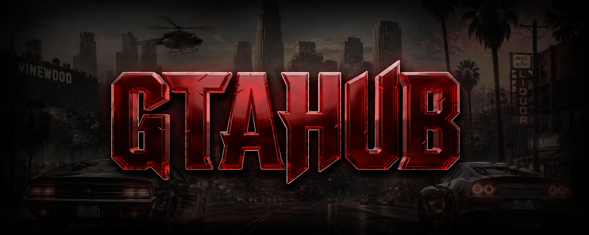

<p align="center">
  
</p>

<h1 align="center">CustomLoadScreen</h1>

<p align="center">
  ASI plugin thay thế màn hình loading mặc định của GTA San Andreas bằng UI tùy chỉnh render bằng GDI+ & Direct3D 9.
</p>

<p align="center">
  
  
  
</p>

---

## 📋 Giới thiệu

**CustomLoadScreen** là ASI plugin cho GTA San Andreas (SA-MP), hoạt động bằng cách hook vtable `IDirect3DDevice9::Present` để chèn màn hình loading hoàn toàn tuỳ chỉnh lên trên game, thay thế loading screen mặc định trong suốt quá trình kết nối server.

**Tính năng chính:**
- Render UI đẹp bằng **GDI+** (anti-aliased text, gradient, rounded corners) overlay lên D3D9
- Progress bar mượt mà với **interpolation 5 giây**
- Đọc thông tin server **trực tiếp từ SAMP memory** (hostname, IP, port, player count)
- Hiển thị elapsed timer, trạng thái kết nối real-time
- Background ảnh `CustomLoadScreen.png` + logo `images/logo.png`
- Output duy nhất **1 file `.asi`** — không phụ thuộc file ngoài

---

## 🗂️ Cấu trúc repo

```
CustomLoadScreen/
├── CustomLoadScreen.cpp     # Logic chính: hook Present, render UI (GDI+/D3D9)
├── CustomLoadScreen.h       # Class declaration + members
├── loader.cpp               # DllMain, D3D9 vtable hook, WndProc, threading
├── loader.h                 # Global structs: g_vars, g_class, g_handle
├── types_compat.h           # Type aliases tương thích MSVC/MinGW
├── CMakeLists.txt           # CMake build (C++17, 32-bit bắt buộc)
├── .gitlab-ci.yml           # CI build via MXE toolchain
├── UI.html                  # Source HTML reference (embed vào .cpp khi build)
│
├── d3d9/                    # DirectX 9 rendering layer
│   ├── proxydirectx.*       # IDirect3DDevice9 proxy wrapper
│   ├── directx.*            # CDirectX — device + Present callback manager
│   ├── d3drender.*          # CD3DFont, CD3DRender (box, line, text)
│   ├── texture.*            # SRTexture — render-to-texture + sprite
│   ├── color.*              # SRColor helper (ARGB)
│   └── MenuManager/         # UI widget system (Menu, Node, Text, Slider...)
│
├── llmo/                    # Low-level memory operations
│   ├── ccallhook.*          # x86 5-byte CALL hook
│   ├── cshortasm.*          # x86 inline assembler
│   └── memsafe.*            # Safe memory R/W
│
├── CGame/                   # GTA SA / SA-MP game structures
│   ├── samp.h               # stSAMP, stPlayerPool, offsets SA-MP 0.3.7
│   ├── CPed.*               # Ped class (size: 1988 bytes)
│   ├── CVehicle.*           # Vehicle class (size: 2584 bytes)
│   ├── CCamera.*, CCam.*    # Camera
│   └── Types.*, methods.*   # Common types & helpers
│
└── sys/
    └── mman.*               # mmap shim for Windows
```

---

## ⚙️ Yêu cầu

| Thành phần | Phiên bản |
|---|---|
| CMake | ≥ 3.20 |
| Compiler | MSVC 2019/2022 (32-bit) hoặc MinGW i686-w64 |
| DirectX SDK | June 2010 |
| GDI+ | Built-in Windows (không cần cài thêm) |
| C++ Standard | C++17 |
| GTA San Andreas | v1.0 US (1.0.0.0) |
| SA-MP | 0.3.7 R1/R3 |

---

## 🚀 Build

### MSVC (khuyến nghị cho Windows)

```bat
cmake -S . -B build -A Win32
cmake --build build --config Release
```

Output: `Release\CustomLoadScreen.asi`

### MinGW 32-bit (Linux cross-compile / MXE)

```bash
cmake -S . -B build -G Ninja \
  -DCMAKE_BUILD_TYPE=Release \
  -DCMAKE_TOOLCHAIN_FILE=/mxe/usr/i686-w64-mingw32.static.posix/share/cmake/mxe-conf.cmake
cmake --build build --parallel $(nproc)
```

Output: `CustomLoadScreen.asi` ở thư mục gốc

> **Lưu ý:** DirectX SDK June 2010 phải được cài hoặc set biến môi trường `DXSDK_DIR`.  
> CMake tự động tìm tại `C:\Program Files (x86)\Microsoft DirectX SDK (June 2010)`.

---

## 📦 Cài đặt

1. Build project hoặc tải `CustomLoadScreen.asi` từ [Releases](../../releases)
2. Copy vào thư mục gốc **GTA San Andreas** (cùng chỗ với `gta_sa.exe`):
   ```
   GTA San Andreas/
   ├── gta_sa.exe
   ├── CustomLoadScreen.asi       ← copy vào đây
   ├── CustomLoadScreen.png       ← ảnh background (tuỳ chọn)
   └── images/
       └── logo.png               ← logo server (tuỳ chọn)
   ```
3. Đảm bảo đã có **ASI Loader** (ví dụ: [Ultimate ASI Loader](https://github.com/ThirteenAG/Ultimate-ASI-Loader))
4. Khởi động game và kết nối server SA-MP

---

## 🎨 UI Overview

```
┌────────────────────────────────────────────────────────────────┐
│  [Logo server - images/logo.png]                               │
│                                                                │
│ ╔══════════════════════════════════════════════════════════╗   │
│ ║  GTAHUB ROLEPLAY SERVER                           68%   ║   │
│ ║  ████████████████████████░░░░░░░░░░░░░░░░░░░░░░░░░░░  ║   │
│ ║  Loading game assets...                                 ║   │
│ ║  ● play.gtahub.vn  ● 178/1000  ● 127.0.0.1:7777       ║   │
│ ║  ● Anti-Cheat      ● Assets    ● 00:12                 ║   │
│ ║  v2.5.1                              www.gtahub.vn     ║   │
│ ╚══════════════════════════════════════════════════════════╝   │
└────────────────────────────────────────────────────────────────┘
```

**Thông tin hiển thị real-time từ SA-MP memory:**
- Hostname server (`stSAMP::szHostname`)
- IP:Port (`stSAMP::szIP` + `ulPort`)
- Player count — đếm từ `stPlayerPool::iIsListed[]`
- Elapsed timer kể từ khi load
- Progress bar smooth interpolation 5 giây

---

## 🔧 Tuỳ chỉnh

Chỉnh sửa trực tiếp trong `CustomLoadScreen.cpp` — sau đó rebuild:

| Thành phần | Vị trí |
|---|---|
| Màu sắc UI | `DrawUI()` — các `Color(...)` |
| Font chữ | `FontFamily ff(L"Tahoma")` |
| Tốc độ loading bar | `float speed = 100.0f / 5.0f` (5s) |
| Text footer | `L"v2.5.1"`, `L"www.gtahub.vn"` |
| Ảnh background | `pBgTex->Load("CustomLoadScreen.png")` |
| Logo | `pLogoTex->Load("images/logo.png")` |

---

## 📄 Changelog

### v2.5.1 — *2026-07-30*
- **feat:** Render UI bằng GDI+ (anti-aliased, gradient, rounded corners) thay D3D9 primitives
- **feat:** Progress bar smooth interpolation 5 giây
- **feat:** Hiển thị player count thật từ `stPlayerPool` SA-MP memory
- **feat:** Đọc hostname, IP, port trực tiếp từ `stSAMP` memory (không cần UDP query)
- **feat:** Elapsed timer real-time
- **fix:** Bỏ hoàn toàn CEF dependency — output 1 file `.asi` duy nhất
- **fix:** `__try/__except` tách ra function POD riêng để tránh C2712

### v2.4.0
- **feat:** Tích hợp CEF browser để render HTML overlay
- **feat:** SAMP UDP query lấy server info
- **fix:** `data:text/html;base64` URL cho CEF embedded HTML

### v2.3.0
- **feat:** Nhúng HTML vào binary qua C++ raw string literal
- **feat:** D3D9 progress bar với gradient fill và glow effect
- **refactor:** Bỏ file `ui_config.json` — không cho người dùng tùy chỉnh ngoài

### v2.2.0
- **feat:** CEF browser integration với `create_browser` API
- **feat:** `setProgress()` / `setSampInfo()` JS bridge từ C++ → HTML

### v2.1.0
- **fix:** Thay proxy D3D9 device bằng vtable Present hook trực tiếp
- **fix:** Resolve QueryInterface IID mismatch crash với `modloader.asi`
- **feat:** Real-time logger `CustomLoadScreen.log`

### v2.0.0
- **refactor:** Bỏ Qt dependency hoàn toàn, migrate sang C++17 STL thuần
- **fix:** CShortAsm memory crash trên Windows 10/11
- **fix:** 16-byte ESP stack alignment cho MSVC runtime
- **fix:** Null pointer dereference trong D3D9 device proxy

### v1.0.0
- **feat:** Initial release — D3D9 hook + texture render cơ bản

---

## 🐛 Debug

Log file tự động tạo tại thư mục GTA SA:
```
GTA San Andreas/CustomLoadScreen.log
```

Các prefix quan trọng:
| Prefix | Ý nghĩa |
|---|---|
| `[GTAHUB-INIT]` | Plugin attach vào process |
| `[GTAHUB-HOOK]` | D3D9 vtable hook thành công |
| `[PRESENT]` | Frame đầu tiên, khởi tạo texture/font |
| `[SAMP]` | Đọc server info từ SAMP memory |
| `[CEF]` | CEF module detection (fallback) |

---

## 📄 License
Remake from https://gitlab.com/prime-hack/samp/plugins/customloadscreen/
© GTAHUB / SR_team. All rights reserved.